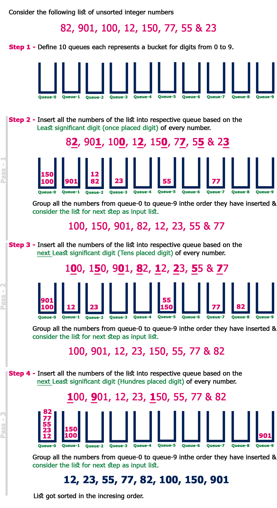

# Radix Sort - more straightforward

## Radix Sort



```javascript
// function getDigit(number, index){
//     var convertedTostring = number.toString();
//     var adjustedIndex = convertedTostring.length - index - 1;
//     console.log(convertedTostring[adjustedIndex]);
//     if(convertedTostring[adjustedIndex] === undefined){
//         return 0;
//     }

//     return convertedTostring[adjustedIndex];

// }

function getDigit(num, i){
    if(num === 0) return 0;
    return Math.floor(Math.abs(num) / Math.pow(10, i)) % 10;

}

function digitCount(num){
    if(num === 0) return 1;
    return Math.floor(Math.log10(Math.abs(num))) + 1;
}


function mostDigits(arr1){
    var maximum = digitCount(arr1[0]);
    arr1.forEach(element => {
        var digitCountNum = digitCount(element);

        if(digitCountNum > maximum){
            maximum = digitCountNum;
        }
    }
       );

     return maximum;
}

console.log("testcase" + getDigit(10, 1));


function radixSort(arr){
    var maxLoop = mostDigits(arr);
    
    
    for(var j = 0; j < maxLoop; j++){

        var emptyBucket = [[],[],[],[],[],[],[],[],[],[]];          //Array.from({length: 10}, () => [])

        for(var i = 0; i < arr.length; i++){
          
            var digit = getDigit(arr[i], j);

            emptyBucket[digit].push(arr[i]);
             
        }
        arr = [];

        for(var x  = 0; x < emptyBucket.length; x++){
            arr = arr.concat(emptyBucket[x]);                   //[].concat(...digitBuckets); !== [].concat([[1],[2],[3]])
        }
    
//         console.log("new arr is: " + arr);
//         console.log("new arr is: " + arr.length);

    }

    
    return arr;


}

radixSort([10,9680,9420,2030,3221,1,5622,82,4793,743,577,7]);

// getDigit(12345, 0); //5
// getDigit(12345,1);  //4
// getDigit(12345,2);  //3
// getDigit(12345,3);  //2
// getDigit(12345,4);  //1
// getDigit(12345,5);  //0
// getDigit(7323,2);
// digitCount(0);
// mostDigits([1234,56,7]);
// mostDigits([1,1,11111,1]);
//mostDigits([12,34,56,78]);

//digitCount(25);
//digitCount(314);
```

