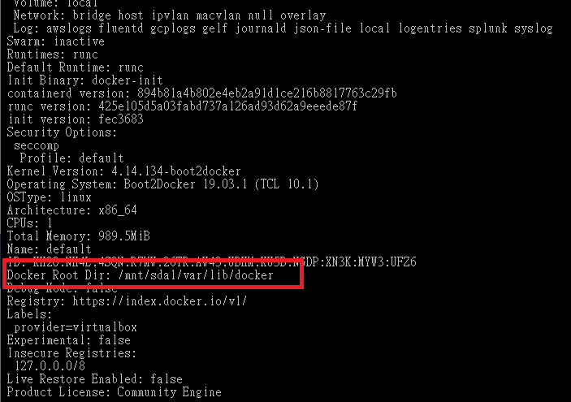

# My Docker images location

## Docker-Machine 

I am using Windows 10 and my docker is based on the vm machine running on my Windows....

```
$docker-machine env default
```


 I guess they are for Docker Hub connection

[https://pages.xebia.com/newsletter/getting-started-with-docker](https://pages.xebia.com/newsletter/getting-started-with-docker)


```text
$docker-info
```

The docker image is stored at /mnt/sdal/var/lib/docker. We have to navigate to docker-machine default in order to view our image files.



```text
$docker-machine ls
```

Let's ssh into our docker-machine

```text
$docker-machine ssh default 
```


