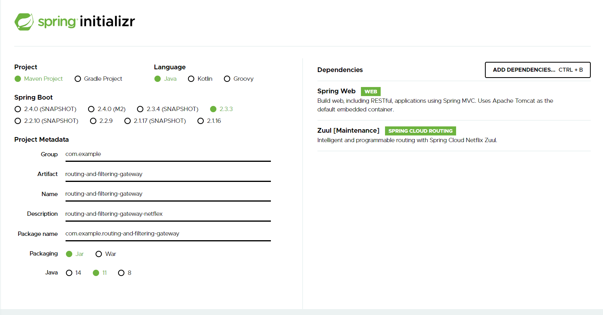
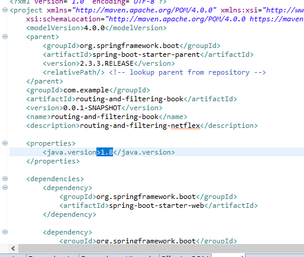
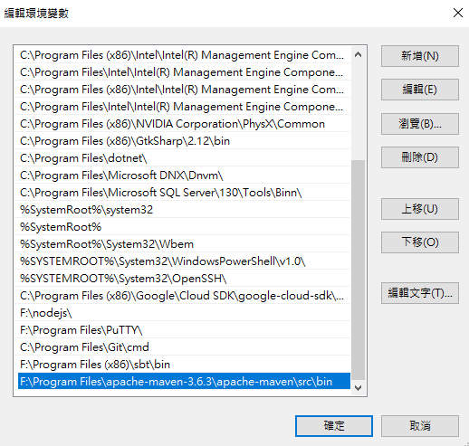

# Netflix-system-design-in-simple-language-PART1-ZUUL

## ZUUL

Zuul is the front door for all requests from devices and websites to the backend of the Netflix streaming application. As an edge service application, Zuul is built to enable dynamic routing, monitoring, resiliency, and security. 

[](https://2.bp.blogspot.com/-nqD3B63uTPU/WCsZxD4b3gI/AAAAAAAAIis/SwfFA7ODFe8BEEouuMWwYbm_D_dyNnrBgCLcB/s1600/Screen%2BShot%2B2016-11-15%2Bat%2B12.20.33.png)

Routing is an integral part of a microservice architecture. For example, **/api/users** is mapped to the user service and **/api/shop** is mapped to the shop service. Zuul is a JVM-based router and server side load balancer by Netflix. 

Source: [https://dzone.com/articles/spring-cloud-netflix-zuul-edge-serverapi-gatewayga\#:~:text=Zuul%20is%20the%20front%20door,monitoring%2C%20resiliency%2C%20and%20security.&text=Zuul%20is%20a%20JVM%2Dbased,side%20load%20balancer%20by%20Netflix.](https://dzone.com/articles/spring-cloud-netflix-zuul-edge-serverapi-gatewayga#:~:text=Zuul%20is%20the%20front%20door,monitoring%2C%20resiliency%2C%20and%20security.&text=Zuul%20is%20a%20JVM%2Dbased,side%20load%20balancer%20by%20Netflix.) 

Tutorial: [https://spring.io/guides/gs/routing-and-filtering/](https://spring.io/guides/gs/routing-and-filtering/)








Once you're strong enough, save the world:


```bash
# Ain't no code for that yet, sorry
echo 'You got to trust me on this, I saved the world'
```



