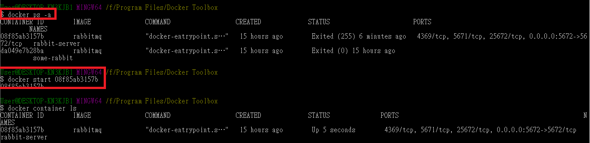

# RabbitMQ Setup - "Docker way"

## Setup - .....

Follow this links and you will be fine, until you find out that you cannot download Erlang which is required in setting up RabbitMQ. 



🤬 Let's use Docker then!~ 

[https://registry.hub.docker.com/\_/rabbitmq/](https://registry.hub.docker.com/_/rabbitmq/)

```bash
$docker pull rabbitmq
```

```bash
$docker run -d --hostname my-rabbit --name rabbit-server -p 5672:5672 rabbitmq
```

 Use the command `docker exec -it <container name> /bin/bash` to get a bash shell in the container

Easy Peasy 😚 

Start the container after created:




For Environment set up: [https://stackoverflow.com/questions/41089268/rabbitmq-connection-refused-from-docker-container-to-local-host](https://stackoverflow.com/questions/41089268/rabbitmq-connection-refused-from-docker-container-to-local-host)


Finally, I can start the tutorial on [https://www.rabbitmq.com/tutorials/tutorial-one-python.html](https://www.rabbitmq.com/tutorials/tutorial-one-python.html). 🥳 


