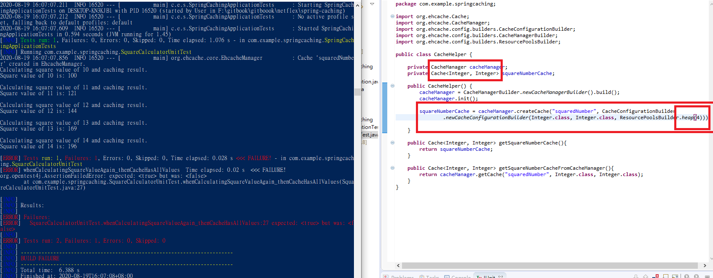

# Ehcache

Tutorial: [https://www.baeldung.com/ehcache](https://www.baeldung.com/ehcache)

## Something to play with:

**ResourcePoolsBuilder.heap\(10\):** 

[https://www.ehcache.org/documentation/3.3/tiering.html](https://www.ehcache.org/documentation/3.3/tiering.html)

#### Storage Tiers: [https://www.ehcache.org/documentation/3.4/getting-started.html](https://www.ehcache.org/documentation/3.4/getting-started.html) 

