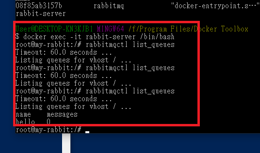

# RabbitMQ - Hello World - remarks

Source Code: 

Receiver =&gt;

Producer =&gt; 

View the queues inside RabbitMQ Server:

```
$ sudo rabbitmqctl list_queues
```



**HostName:** 

```text
$ docker-machine ip
```

