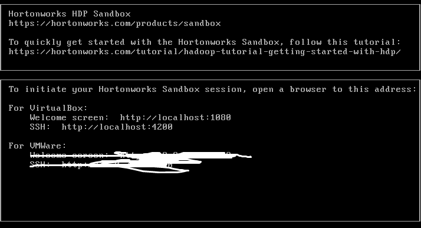
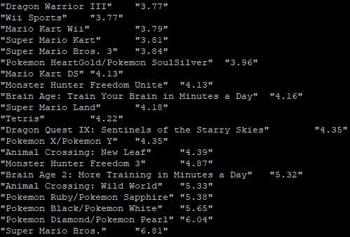

# The Best selling video games - Hadoop \#MapReduce - 12/07/2020

## Data Source

The source: [https://www.kaggle.com/rush4ratio/video-game-sales-with-ratings](https://www.kaggle.com/rush4ratio/video-game-sales-with-ratings)

## Aim

### ETL

The application aim at finding out what is the best seeling games of all time in Japan using Hadoop MapReduce.

Firstly, the data downloaded from the above website is somewhat "raw data". Fortunately, only a few steps of manipulation have to be done before putting the data to the Hortonworks SandBox \(our virtual machine\).

There are certain ways to manipulate the data. I have chosen the easiest way. As the raw data is in CSV format, putting the raw data into google excel and adjusted the data using simple formula seems to be a good fit for me.

**Noticing that there are various empty fields, it is recommended to replace or assign those empty fields to certain strings/int, say like, "NULL". After the replacement, convert the file format into tsv, we want to split the data by "tab" instead of ",".**


Remember to make a copy of your original data and make the adjustment from the copied version



```bash
=Arrayformula(If(isblank({Video_Games_Sales_as_at_22_Dec_2016_adjusted!A1:P16720}),"NULL",{Video_Games_Sales_as_at_22_Dec_2016_adjusted!A1:P16720}))
```


### SandBox - Hortonworks Sandbox

Details are as follows_:_ [https://www.cloudera.com/downloads/hortonworks-sandbox/hdp.html](https://www.cloudera.com/downloads/hortonworks-sandbox/hdp.html)

My sandbox version is 2.6.5, and the virtual machine interface looks like this:



## Run the script on the virtual machine

### ssh to the virtual machine


Port is **2222**, instead of 4200


Windows: Use **Putty**

Mac/Linux: **ssh maria\_dev@127.0.0.1 -p 2222**

### scp the games sales data to the virtual machine


scp -P 2222 .\Video\_Games\_Sales\_as\_at\_22\_Dec\_2016\_adjusted.tsv maria\_dev@127.0.0.1:/home/maria\_dev


### copy the data from virtual machine to Hadoop file system


hadoop fs -mkdir games-sales

hadoop fs -ls

hadoop fs -copyFromLocal Video\_Games\_Sales\_as\_at\_22\_Dec\_2016\_adjusted.tsv games-sales/Video\_Games\_Sales\_as\_at\_22\_Dec\_2016\_adjusted.tsv


### other dependencies


PIP

* cd /etc/yum.repos.d
* cp sandbox.repo /tmp
* rm sandbox.repo
* cd ~
* yum install python-pip

MRJob

* pip install google-api-python-client==1.6.4
* pip install mrjob==0.5.11


### The Script - SalesBreakdown.py

```python
from mrjob.job import MRJob
from mrjob.step import MRStep

class SalesBreakDown(MRJob):
        def steps(self):
                retrn[
                        MRStep(mapper=self.mapper_get_sales_figure,
                                reducer=self.reducer_sorted_output)
                ]
        def mapper_get_sales_figure(self, _, line):
                (name,platform,year_of_Release,genre,publisher,nA_sales,eU_sales,jP_Sales,other_Sales,global_Sales,critic_Score,critic_Count,user_Score,user_Count,developer,rating) = line.split('\t')
                yield str(jP_Sales.zfill(4)), name

        def reducer_sorted_output(self, salesAmt, games):
                for game in games:
                        yield game, salesAmt

if __name__ == '__main__':
        SalesBreakDown.run()
```


zfill\(4\) is used to convert the float number so that reducer\_sorted\_output can sort the salesAmt accordingly


### Result

#### run the script

```python
python SalesBreakdown.py -r hadoop --hadoop-streaming-jar /usr/hdp/current/hadoop-mapreduce-client/hadoop-streaming.jar hdfs://sandbox-hdp.hortonworks.com:8020/user/maria_dev/games-sales/Video_Games_Sales_as_at_22_Dec_2016_adjusted.tsv
```

Is the result match your expectation? XD



