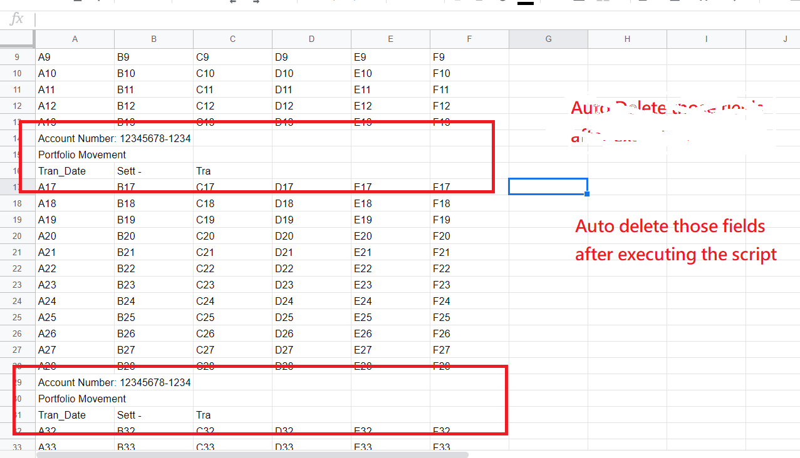

# My Friend is in Crisis - Excel Issue - 09/08/2020

## How to delete unnecessary rows in a large data set in excel? 



DataSet: [https://docs.google.com/spreadsheets/d/1-TzgwV02XOOpp4m1xKFwpi0BqDYgSjaPihepwbBt78I/edit?usp=sharing](https://docs.google.com/spreadsheets/d/1-TzgwV02XOOpp4m1xKFwpi0BqDYgSjaPihepwbBt78I/edit?usp=sharing)

## Google Sheet:

```
    Logger.log("data[i][0]: " + data[i][0]);
    
    if(data[i][0].includes("Account") || data[i][0].includes("Portfolio") || data[i][0].includes("Tran")) {

      Logger.log("index: " + i);
      s.deleteRow(i + 1 - counter);
      counter ++;

    }
    
    
  }
```

## Excel Macro - VBA

```javascript
Sub Delete_All_Rows_IF_Cell_Contains_Certain_String_Text()
    Dim lRow As Long
    Dim iCntr As Long
 
    lRow = 20000
    For iCntr = lRow To 1 Step -1
        If Cells(iCntr, 1).Value = "Portfolio Movement" Then
            Rows(iCntr).Delete
       End If
 
       If Cells(iCntr, 1).Value Like "Account*" Then
            Rows(iCntr).Delete
        End If
 
        If Cells(iCntr, 1).Value Like "Tran_Date" Then
            Rows(iCntr).Delete
        End If
 
    Next
    End
End Sub
```


