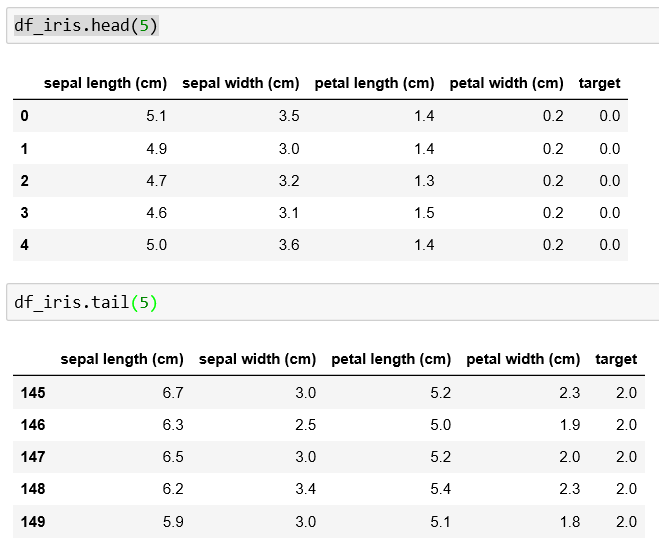
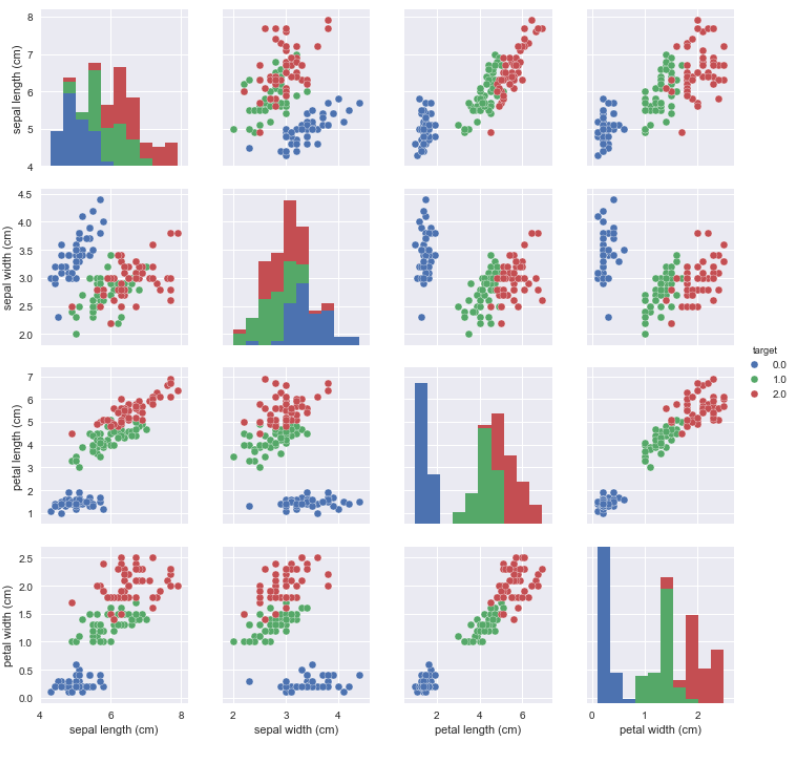
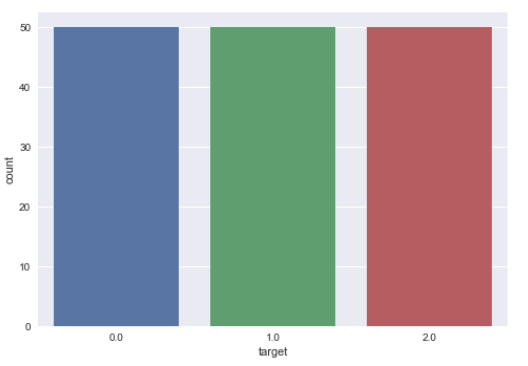

# Support Vector Machine, SVM - Iris - 12/07/2020

## Classifying Iris Subspecies

Today, we are going to classify a flower type, namely, Iris, into different subspecies \(Setosa ,Versicolor, Virginica\) based on their size.

Firstly, import the commonly used libraries in machine learning and the datasets provided by Sklearn to start our project

```python
import pandas as pd # Import Pandas for data manipulation using dataframes
import numpy as np # Import Numpy for data statistical analysis 
import matplotlib.pyplot as plt # Import matplotlib for data visualisation
import seaborn as sns # Statistical data visualization

####IRIS DATASETS#####
from sklearn.datasets import load_iris
iris = load_iris()
```


Super-powers are granted randomly so please submit an issue if you're not happy with yours.


Once the data is loaded, you can check the details by going through the object keys:


```python
# dict_keys(['data', 'target', 'target_names', 'DESCR', 'feature_names'])
```


After reviewing the details, you should find out that the datasets is from Fisher, R.A

```python
print(iris['DESCR'])
```

> Fisher,R.A. "The use of multiple measurements in taxonomic problems" Annual Eugenics, 7, Part II, 179-188 \(1936\); also in "Contributions to Mathematical Statistics" \(John Wiley, NY, 1950\).

```python
iris['data'].shape
#(150, 4)
#There are 150 records for us to use
```

```python
df_iris = pd.DataFrame(np.c_[iris['data'], iris['target']], columns = np.append(iris['feature_names'], ['target']))
```


np.r\_ = add by columns, return the same number of columns after adding

np.c\_ = add by rows, return the same number of rows after adding

add by columns


### Datasets overview




Certain pattern can be observed only by listing the data, for example, target 2.0 size is generally larger than target 0.0


## VISUALIZING THE DATA

```python
sns.pairplot(df_iris, hue = 'target', vars = ['sepal length (cm)', 'sepal width (cm)', 'petal length (cm)', 'petal width (cm)'] )
plt.show()    #fig.1
sns.countplot(df_iris['target'], label = "Count") 
plt.show()    #fig.2
```





## Model Training

Define both X and y in which X is independent variable, y is dependent variable \(the subspecies that the model is going to predict\)

```python
X = df_iris.drop(['target'],axis=1)
y = df_iris['target']
```


axis=1, {0 or ‘index’, 1 or ‘columns’}, default 0


Splitting 20 % of the data as test data, 80% as the training data

```python
from sklearn.model_selection import train_test_split

X_train, X_test, y_train, y_test = train_test_split(X, y, test_size = 0.20, random_state=5)
```


random\_state is the seed used by the random number generator


### Before training the data, some optimizations have to be done: Normalization, C parameters and Gamma

```python
#Normalization to both training data and test data
min_train = X_train.min()
range_train = (X_train.max() - min_train)
X_train_scaled = (X_train - min_train)/range_train

min_test = X_test.min()
range_test = (X_test - min_test).max()
X_test_scaled = (X_test - min_test)/range_test

#Gamma, C parameters
param_grid = {'C': [0.1, 1, 10, 100], 'gamma': [1, 0.1, 0.01, 0.001], 'kernel': ['rbf']}
```

### Train the model based on different data & compare with different results

```python
##########result - without optimization##########
from sklearn.svm import SVC 
from sklearn.metrics import classification_report, confusion_matrix

svc_model = SVC()
svc_model.fit(X_train, y_train)

y_predict = svc_model.predict(X_test)
cm = confusion_matrix(y_test, y_predict)

sns.heatmap(cm, annot=True)
plt.show()

print(classification_report(y_test, y_predict))


##########result - with normalization##########
from sklearn.svm import SVC 
from sklearn.metrics import classification_report, confusion_matrix

svc_model = SVC()
svc_model.fit(X_train_scaled, y_train)

y_predict = svc_model.predict(X_test_scaled)
cm = confusion_matrix(y_test, y_predict)

sns.heatmap(cm, annot=True)
plt.show()

print(classification_report(y_test,y_predict))


##########result - with param_grid adjusting##########
from sklearn.model_selection import GridSearchCV

grid = GridSearchCV(SVC(),param_grid,refit=True,verbose=4)
grid.fit(X_train_scaled,y_train)
grid_predictions = grid.predict(X_test_scaled)

cm = confusion_matrix(y_test, grid_predictions)
sns.heatmap(cm, annot=True)
plt.show()

print(classification_report(y_test,grid_predictions))
```

```python
##########Result - without optimization##########
precision    recall  f1-score   support

        0.0       1.00      1.00      1.00         8
        1.0       1.00      0.91      0.95        11
        2.0       0.92      1.00      0.96        11

avg / total       0.97      0.97      0.97        30
```

```python
##########Result - with normalization##########
precision    recall  f1-score   support

        0.0       1.00      1.00      1.00         8
        1.0       0.83      0.91      0.87        11
        2.0       0.90      0.82      0.86        11

avg / total       0.90      0.90      0.90        30
```

```python
##########Result - with param_grid adjusting##########
precision    recall  f1-score   support

        0.0       1.00      1.00      1.00         8
        1.0       1.00      0.82      0.90        11
        2.0       0.85      1.00      0.92        11

avg / total       0.94      0.93      0.93        30
```

