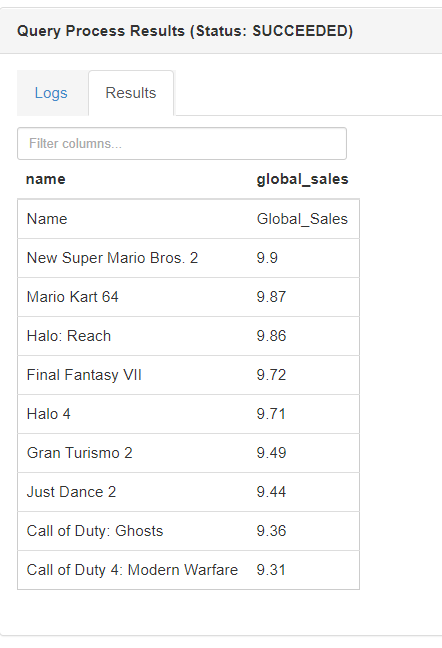

# Hive - Relational database - Importing data + read all - 14/07/2020

## Create a table on Ambari using Hive

It is a simple process using SQL-like syntax:

```sql
CREATE TABLE gamesalesss(
  name STRING,
  platform STRING,
  year_of_Release STRING,
  genre STRING,
  publisher STRING,
  nA_sales STRING,
  eU_sales STRING,
  jP_Sales STRING,
  other_Sales STRING,
  global_Sales STRING,
  critic_Score STRING, 
  critic_Count STRING,
  user_Score STRING,
  user_Count STRING,
  developer STRING,
  rating STRING)
ROW FORMAT DELIMITED
FIELDS TERMINATED BY '\t'
STORED AS TEXTFILE;


LOAD DATA LOCAL INPATH '/tmp/Video_Games_Sales_as_at_22_Dec_2016_adjusted.tsv'
OVERWRITE INTO TABLE gamesalesss;
```


Please, give write + read access to everyone to folder /tmp, otherwise Hive will alert that the system cannot find the file


Once you're done, check the result

```sql
SELECT * FROM gamesalesss LIMIT 100;
```

```sql
SELECT name, global_sales FROM gamesalesss ORDER BY global_sales DESC LIMIT 10;
```



