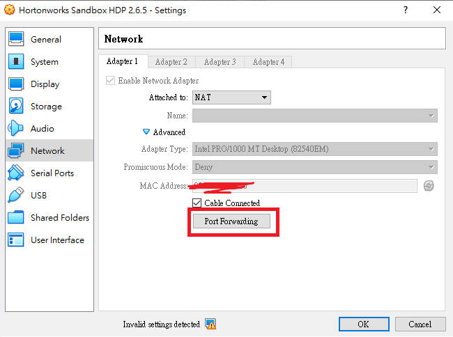
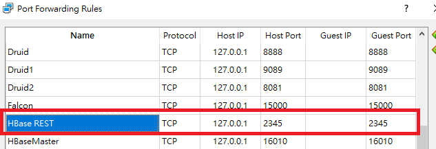

# HBase - Non-Relational DataBase - Importing data - 15/07/2020

## HBase Rest APIs

Start the HBase REST APIs port:

if you're using VirtualBox version, you have to set up port forwarding at the setting panel:






Set the Port to 8000


ssh to the vm, change to root user and start up HBase Rest Service porting 8000 \(it is my favorite port number\)

```bash
su root
/usr/hdp/current/hbase-master/bin/hbase-daemon.sh start rest -p 8000 --infoport 8001
```


Super-powers are granted randomly so please submit an issue if you're not happy with yours.


Once all set, let's move to the scripting part using Python with the help of the library "Starbase".

```python
pip install starbase
```

```python
from starbase import Connection

c = Connection(host='127.0.0.1', port=8000)
#print(c.tables())
#t = c.table('table3')
#t.create('column1', 'column2', 'column3')
#t.exists()
#print(t.exists())
games = c.table('gamestarbase')

#if(games.exists()):
#    print("Dropping existing gamestarbase table\n")
#    games.drop()

games.create('sales')

print("Parsing the game sales data...\n")
print(games.exists())

gamesFile = open("F:/hapdoop/Video_Games_Sales_as_at_22_Dec_2016_adjusted.tsv", "r")

b = games.batch()

for line in gamesFile:
    (name,platform,year_of_Release,genre,publisher,nA_sales,eU_sales,jP_Sales,other_Sales,global_Sales,critic_Score,critic_Count,user_Score,user_Count,developer,rating) = line.split('\t')
    b.update(name, {'sales': {eU_sales: nA_sales}})

gamesFile.close()

print("Committing sales data to HBase via REST service\n")
b.commit(finalize=True)

print("Get back sales for some games...\n")
print("Wii Sports: \n")
print(games.fetch("Wii Sports"))
print("Tetris: \n")
print(games.fetch("Tetris"))

games.drop()
```

Execute the above script to import the data to HBase and get the result via script

```bash
python .\hbasestarbase.py
```

