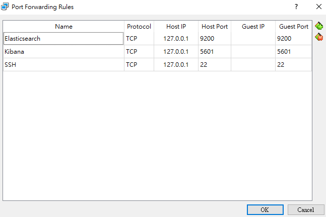

# ElasticSearch  - Add mapping + POST & GET A Single Entry - 21/07/2020

## Ports setting



## ElasticSearch RESTAPI

Template

```bash
mkdir /bin
nano curl
chmod a+x curl
cd ~
source .profile #update environment variable curl
which curl #/home/econgamer/bin/curl
```

```bash
#!/bin/bash
/usr/bin/curl -H "Content-Type: application/json" "$@"
```

Put the entry into /movies directory

```bash
curl -XPUT 127.0.0.1:9200/movies -d '
{
    "mappings": {
        "properties": {
            "year": {
                "type": "date"
            }
        }
    }
}'
```

Checking the mapping afterward

```bash
curl -XGET 127.0.0.1:9200/movies/_mapping
```

POST the single movie entry

```bash
curl -XPOST 127.0.0.1:9200/movies/_doc/109487 -d '
{
    "genre" : ["IMAX", "Sci-Fi"],
    "title": "Interstellar",
    "year": 2014
}'
```

GET all movies in pretty format

```bash
curl -XGET 127.0.0.1:9200/movies/_search?pretty
```

