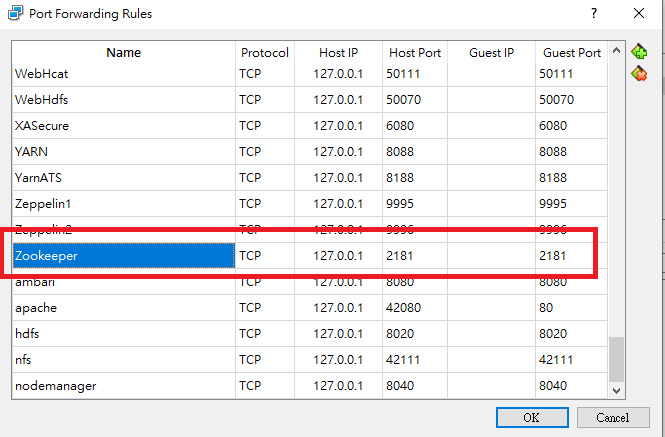
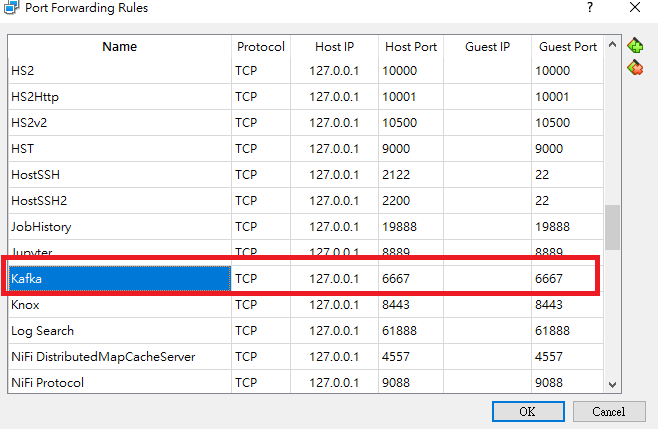

# kafka - like ncat in a distribution system - simple connection - 18/07/2020

## Kafka aims to provide a unified, high-throughput, low-latency platform for handling real-time data feeds. - From Google

There are three roles that need to be setup

**location:** _**/usr/hdp/current/kafka-broker/bin**_

1. kafka-topics.sh

Create a kafka-topics named test for consumer to subscribe and producer to produce

```text
./kafka-topics.sh --create --zookeeper sandbox-hdp.hortonworks.com:2181 --replication-factor 1 --partitions 1 --topic test
```

```bash
# official demo - https://kafka.apache.org/quickstart
./kafka-topics.sh --create --bootstrap-server localhost:9092 --replication-factor 1 --partitions 1 --topic test
```




To clean out the confusion above, in the Hortonworks Sandbox, zookeeper services have already been setup, thus the first code block and port 2181 should be used.



```bash
# You miight list out the topics to check all the available topics
```


1. kafka-console-producer

```bash
/kafka-console-producer.sh --broker-list sandbox-hdp.horotoworks.com:6667 --zookeeper sandbox-hdp.hortonworks.com:2181 --topic test
```

```bash
# official demo - https://kafka.apache.org/quickstart
./kafka-console-producer.sh --bootstrap-server localhost:9092 --topic test
```




port 6667 should be used in our case


### Finally, open another terminal and kick start consumer

```bash
./kafka-console-consumer.sh --bootstrap-server sandbox.hortonworks.com:6667 --zookeeper sandbox-hdp.hortonworks.com:2181 --topic test --from-beginning
```

```bash
# official demo - https://kafka.apache.org/quickstart
/kafka-console-consumer.sh --bootstrap-server localhost:9092 --topic test --from-beginning
```


"--from-beginning" helps capturing all the logs from the beginning


**Connection is established**

